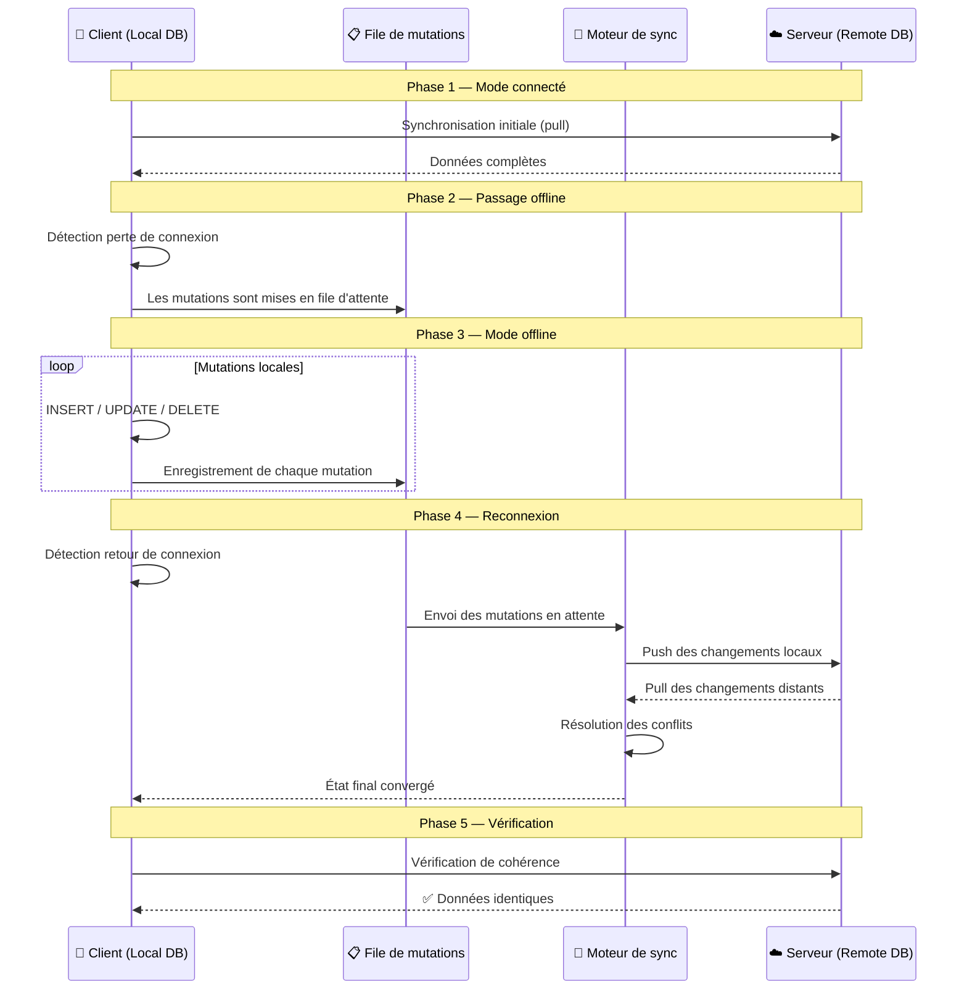
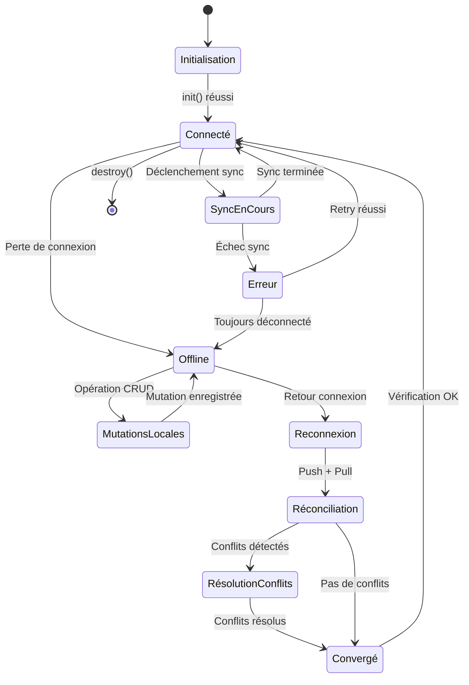
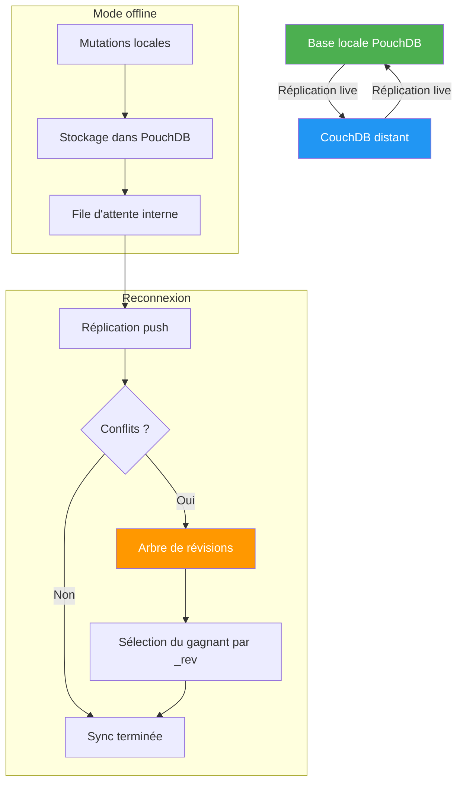
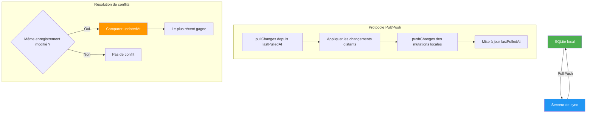
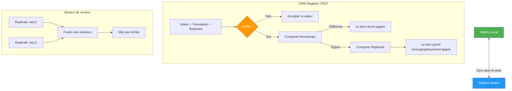
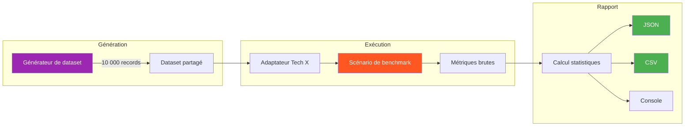

# Cycle de Synchronisation

## Vue d'ensemble

Ce document décrit le cycle de synchronisation implémenté par chaque technologie benchmarkée. Des diagrammes Mermaid illustrent le flux de données, les états possibles et les mécanismes de résolution de conflits.

---

## Diagramme global du cycle de synchronisation

---

## Diagramme d'état de la synchronisation

---

## Cycle par technologie

### PouchDB + CouchDB

**Mécanisme de résolution de conflits PouchDB :**
- PouchDB maintient un **arbre de révisions** (_rev) pour chaque document
- En cas de conflit, les deux versions sont stockées comme branches
- Le "gagnant" est déterminé par un algorithme déterministe basé sur le hash de la révision
- Les conflits non résolus restent accessibles via `doc._conflicts`

### WatermelonDB

**Mécanisme de résolution de conflits WatermelonDB :**
- Stratégie **Last-Write-Wins** (le dernier écrit gagne)
- Basé sur le champ `updatedAt` (timestamp)
- Simple mais peut entraîner une perte de données silencieuse
- Pas de détection de conflit côté client

### Ditto (CRDT)

**Mécanisme de résolution de conflits Ditto (simulé) :**
- **LWW-Register** : chaque champ a un timestamp et un identifiant de réplica
- En cas de conflit : le timestamp le plus élevé gagne
- En cas d'égalité : le `replicaId` le plus grand (lexicographique) gagne
- **Vecteurs de version** : permettent la synchronisation par delta (seules les modifications non vues sont échangées)
- **Tombstones** : les suppressions sont marquées (pas de suppression physique), garantissant la convergence
- **Propriétés CRDT** :
  - ✅ Commutativité (l'ordre des opérations n'importe pas)
  - ✅ Associativité (les groupements n'importent pas)
  - ✅ Idempotence (appliquer deux fois la même opération donne le même résultat)

---

## Comparaison des stratégies de résolution

| Critère | PouchDB | WatermelonDB | Ditto (CRDT) |
|---------|---------|-------------|-------------|
| **Stratégie** | Arbre de révisions | Last-Write-Wins | LWW-Register CRDT |
| **Déterminisme** | ✅ Oui (hash _rev) | ✅ Oui (timestamp) | ✅ Oui (timestamp + replicaId) |
| **Perte de données** | Non (conflits conservés) | Possible (écrasement) | Non (convergence garantie) |
| **Complexité** | Moyenne | Faible | Élevée |
| **Résolution manuelle** | Possible (`_conflicts`) | Non | Non nécessaire |
| **Convergence garantie** | Oui | Oui (si horloges sync) | Oui (mathématiquement prouvé) |

---

## Flux de données pendant le benchmark

