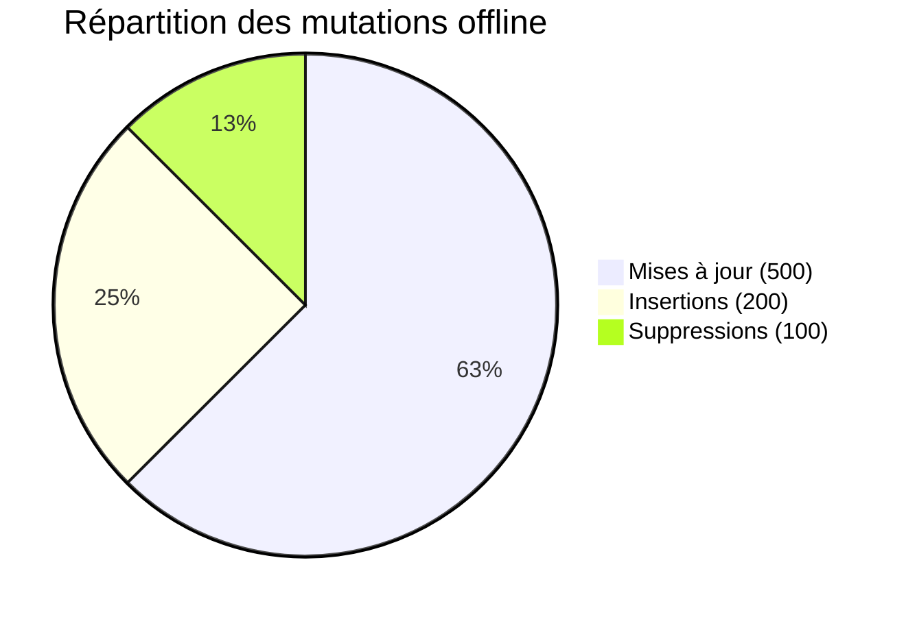
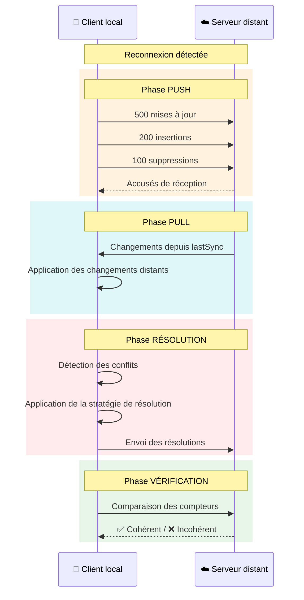

# Tests en Mode Dégradé

## Introduction

Le mode dégradé (offline) est un cas d'usage critique pour StageOps. Les opérateurs sur le terrain peuvent perdre leur connexion pendant des périodes prolongées et doivent pouvoir continuer à travailler. Ce document décrit comment le benchmark simule et teste ce scénario.

---

## Simulation du mode offline

### Principe

Le benchmark simule le mode offline en **désactivant la synchronisation** au niveau de l'adaptateur, sans couper réellement le réseau. Cela permet :

- Un contrôle précis du moment de déconnexion/reconnexion
- La reproduction exacte des conditions de test
- L'exécution rapide sans attente réelle de 30 minutes

### Implémentation par technologie

#### PouchDB

```
goOffline() → Annulation du handler de réplication live (syncHandler.cancel())
goOnline()  → Pas de reprise automatique ; sync déclenchée explicitement
```

- La réplication live PouchDB utilise un EventEmitter
- L'appel `cancel()` arrête proprement la réplication
- Les mutations locales continuent de s'écrire dans PouchDB
- À la reconnexion, une nouvelle réplication est démarrée

#### WatermelonDB

```
goOffline() → Drapeau isOffline = true ; les mutations s'accumulent dans pendingChanges
goOnline()  → Drapeau isOffline = false
```

- Le protocole push/pull ne s'exécute que si `isOffline === false`
- Les mutations sont stockées dans trois files : `created`, `updated`, `deleted`
- À la reconnexion, le cycle push/pull complet est déclenché

#### Ditto (CRDT)

```
goOffline() → Drapeau isOffline = true ; les ops sont stockées dans pendingOps
goOnline()  → Drapeau isOffline = false
```

- Chaque mutation offline incrémente le compteur de séquence local
- Le vecteur de version est mis à jour localement
- À la reconnexion, les opérations pendantes sont fusionnées via le merge CRDT

---

## Mutations en mode offline

### Types de mutations appliquées

| Type | Nombre | Description |
|------|--------|-------------|
| **Update** | 500 | Modification du payload d'enregistrements existants |
| **Insert** | 200 | Création de nouveaux enregistrements |
| **Delete** | 100 | Suppression d'enregistrements existants |
| **Total** | 800 | Mutations pendant la fenêtre offline |

### Profil des mutations



### Détail des mutations

#### Mises à jour (Updates)

- 500 enregistrements sélectionnés aléatoirement
- Le payload est modifié avec :
  - Un champ `lastModified` (timestamp)
  - Un champ `offlineEdit: true`
  - Des notes aléatoires (~100 caractères)
- Le champ `updatedAt` est mis à jour
- Le champ `version` est incrémenté

#### Insertions

- 200 nouveaux enregistrements générés par le générateur de dataset
- Même schéma que les enregistrements initiaux
- Payload d'environ 1 Ko

#### Suppressions

- 100 enregistrements sélectionnés aléatoirement (différents des updates)
- **PouchDB** : suppression via `db.remove(doc)` (crée une révision de suppression)
- **WatermelonDB** : suppression de la Map locale, ajout à la file `deleted`
- **Ditto** : marquage tombstone (le document reste mais est considéré comme supprimé)

---

## Fenêtre offline de 30 minutes

### Simulation accélérée

Le benchmark ne fait pas attendre 30 minutes réellement. La fenêtre est **simulée** par :

1. **Enregistrement du temps de début** de la période offline
2. **Application immédiate** de toutes les mutations
3. **Notation** de la durée simulée (30 min = 1 800 000 ms) dans les résultats

### Justification

Dans un environnement de production, la durée offline affecte :
- Le nombre de mutations qui s'accumulent
- La taille de la file de synchronisation
- La probabilité de conflits

Notre simulation contrôle directement le nombre de mutations (800) plutôt que la durée, ce qui est plus reproductible et pertinent pour le benchmark.

---

## Processus de réconciliation



---

## Métriques de réconciliation

### Métriques collectées

| Métrique | Description | Unité |
|----------|-------------|-------|
| `syncTimeMs` | Temps total de synchronisation | ms |
| `deltasProcessed` | Nombre de deltas échangés | entier |
| `isConsistent` | Les deux stores sont-ils identiques ? | booléen |
| `mutationTimeMs` | Temps d'application des mutations offline | ms |
| `verification.updatesVerified` | Échantillon de mises à jour vérifiées | n/50 |
| `verification.insertsVerified` | Échantillon d'insertions vérifiées | n/50 |
| `verification.deletesVerified` | Échantillon de suppressions vérifiées | n/50 |

### Vérification de cohérence

Après la synchronisation, le benchmark vérifie :

1. **Mises à jour** : 50 enregistrements modifiés sont relus → doivent exister
2. **Insertions** : 50 nouveaux enregistrements sont relus → doivent exister
3. **Suppressions** : 50 enregistrements supprimés sont relus → ne doivent plus exister

Cette vérification par échantillonnage permet de confirmer que la réconciliation a correctement propagé toutes les mutations.

---

## Cas limites testés

### 1. Conflit update/delete

- Client A modifie un enregistrement
- Client B supprime le même enregistrement
- Résultat attendu :
  - **PouchDB** : le conflit est détectable via `_conflicts`
  - **WatermelonDB** : la suppression gagne (si plus récente)
  - **Ditto** : le tombstone gagne si son timestamp est plus élevé

### 2. Insertions simultanées avec même ID

- Peu probable avec UUID v4 mais théoriquement possible
- Chaque technologie gère ce cas via sa stratégie de résolution habituelle

### 3. Modifications en cascade

- Un enregistrement modifié plusieurs fois pendant la période offline
- Seul l'état final est synchronisé (pas l'historique des modifications)

---

## Recommandations pour le mode dégradé

1. **Limiter la taille des mutations offline** : plus les mutations s'accumulent, plus la réconciliation est longue
2. **Utiliser des identifiants universellement uniques** (UUID v4) pour éviter les collisions
3. **Horodater toutes les mutations** avec des timestamps monotones
4. **Prévoir un mécanisme de file d'attente persistante** en cas de crash pendant la période offline
5. **Tester avec des volumes réalistes** : adapter le nombre de mutations au cas d'usage réel de StageOps
